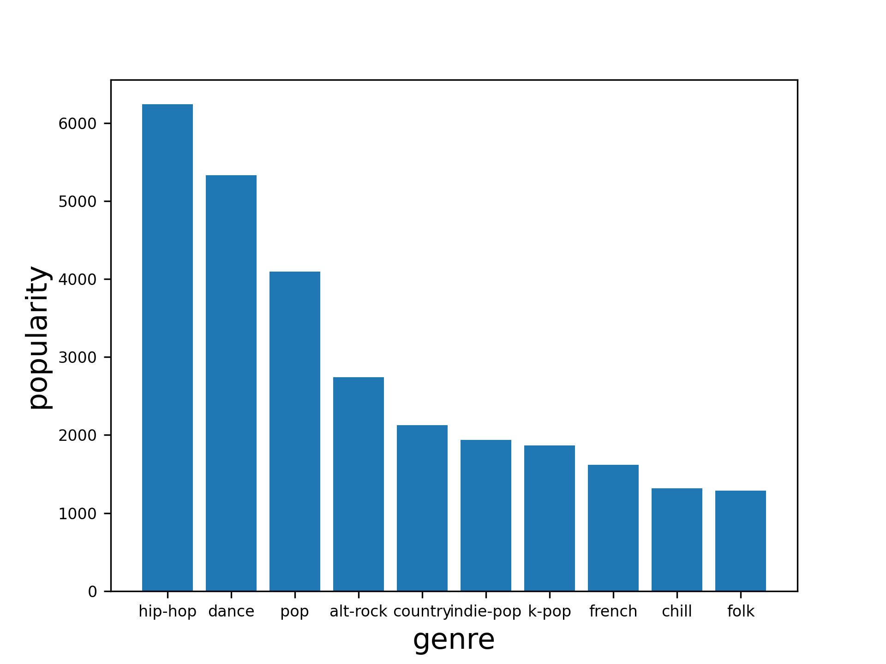
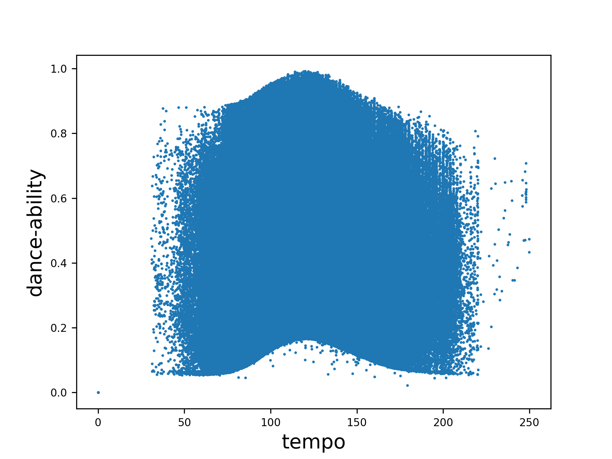
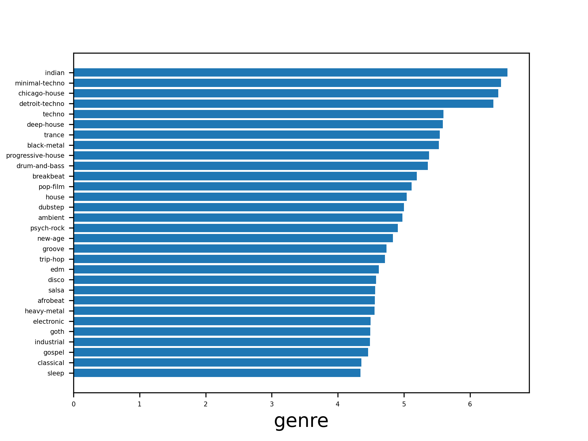

# Spotify_ML - Christian Guidikov
Machine Learning and Data Visualisation project based on a large Kaggle dataset featuring information from musical
streaming platform Spotify.

The dataset used in this project can be found using this link:
https://www.kaggle.com/datasets/amitanshjoshi/spotify-1million-tracks. All the credit for collecting the data goes to 
the authors of the dataset, and this one is posted under the Open Data Commons licence.

To run the files in src for yourself you need to add a "data" folder in the general folder and add the csv file with the
dataset inside.

## Part 1 - Visualisations
We will first do some visualisation of the data provided and then apply some ML models to try and predict some values.
Using libraries pandas, numpy and matplotlib we are easily able to make some interesting observations about the given 
data. Namely, we decided to showcase the most popular genres, the correlation between a song's tempo and its 
dance-ability and the mean length of songs for each genre! These visualisations already showcase the power of using a
complete dataset with many datapoints to work with, which is optimal for Machine Learning.\
Below are the visualisations which can be generated by running the [visualisations file](./src/visualisations.py) and 
calling the desired functions.

Visualisation 1:\

Visualisation 2:\

Visualisation 3:\

## Part 2 - Machine Learning
In this part we will focus on the various machine learning models which we can apply to the dataset. This will in turn 
give us some interesting results which we will try to analyse and conclude upon. Here are some of the most interesting 
predictions one can make using the given dataset:

1) Which genres are going to be most popular?
2) Are songs going to be more positive? (valence)
3) Are songs getting shorter?
4) Are songs getting faster?
5) How to make the most popular song?

We will be using the sklearn library to apply the necessary machine learning models, along with numpy, pandas and 
matplotlib as before. The code is available in the [machine learning file](./src/ml.py), and the results can be 
replicated again by adding the original dataset's csv file in a "data" folder at the project's source.

