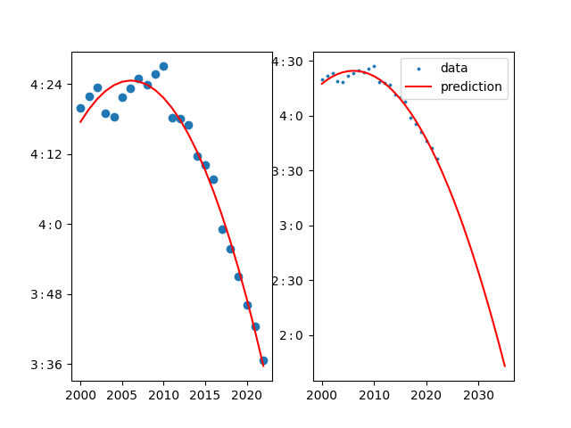
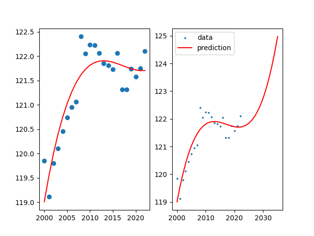

# Spotify_ML - Christian Guidikov
Machine Learning and Data Visualisation project based on a large Kaggle dataset featuring information from musical
streaming platform Spotify.

The dataset used in this project can be found using this link:
https://www.kaggle.com/datasets/amitanshjoshi/spotify-1million-tracks. All the credit for collecting the data goes to 
the authors of the dataset, and this one is posted under the Open Data Commons licence.

To run the files in src for yourself you need to add a "data" folder in the general folder and add the csv file with the
dataset inside.

## Part 1 - Visualisations
We will first do some visualisation of the data provided and then apply some ML models to try and predict some values.
Using libraries pandas, numpy and matplotlib we are easily able to make some interesting observations about the given 
data. Namely, we decided to showcase the most popular genres, the correlation between a song's tempo and its 
dance-ability and the mean length of songs for each genre! These visualisations already showcase the power of using a
complete dataset with many datapoints to work with, which is optimal for Machine Learning.\
Below are the visualisations which can be generated by running the [visualisations file](./src/visualisations.py) and 
calling the desired functions.

Visualisation 1:\

Visualisation 2:\

Visualisation 3:\

## Part 2 - Machine Learning
In this part we will focus on the various machine learning models which we can apply to the dataset. This will in turn 
give us some interesting results which we will try to analyse and conclude upon. Here are some of the most interesting 
predictions one can make using the given dataset:

1) Which genres are going to be most popular?
2) Are songs going to be more positive? (valence)
3) Are songs getting shorter?
4) Are songs getting faster?

We will be using the sklearn library to apply the necessary machine learning models, along with numpy, pandas and 
matplotlib as before. The code is available in the [machine learning file](./src/ml.py), and the results can be 
replicated again by adding the original dataset's csv file in a "data" folder at the project's source.

1) To predict which genres are going to be the most popular, it is interesting to first plot the 10 most popular genres
as a time series, and then try to predict the trend for popularity of the most rapidly increasing ones. We have thus 
done so in the following visualisations:

Using the second plot as a reference, we can see that the most popular genre and the most rapidly increasing one in 
popularity is "pop". It is interesting to also note the rapid increase of "k-pop" which seems to have a linear increase 
over the past 20 years. When extrapolating the predictions made by the model over the next until 2035 we see that pop 
music is still the most popular, while hip-hop takes the lead over k-pop.

2) As for the positivity of songs, we can similarly plot the average valence of the genres, and by taking the same 
genres as in the previous prediction, we get:

We thus note the seemingly decreasing in valence over the past 20 years. However, it is important to note that to better 
fit the data, we here used a 3rd degree polynomial regression model, as we could already notice in the first 
visualisation that the trend seems to be increasing again after around 2016-17. We can also note the stable valence of 
k-pop over the provided dataset compared to the other 3 most popular genres. We can here again extrapolate the plot to 
observe the quick rise in valence of hip-hop, dance and pop.

3) It would also be relevant to analyse the changing length of songs over time, as genres are getting more varied. To do
so we take the mean of the length of each song in the dataset and group by date. We obtain the following visualisations:

While the model is limited by the low number of datapoints, we can still see that the average length of songs is 
decreasing and may reach under three minutes in the upcoming years.

4) Similarly to the song length, we can plot the average tempo of songs over the years:

Here again, we used polynomial regression with degree 3 as it fit the datapoints best. It is important to note that, 
while the increase seems to be exponential after around 2025, the y-axis labels show that the increase is only of a few 
beats per minute.